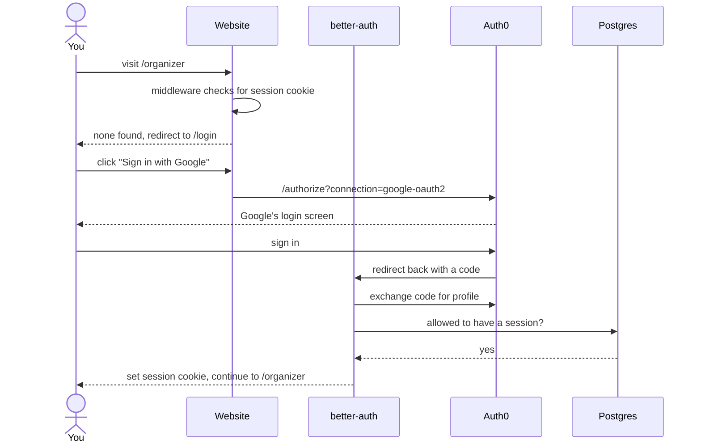
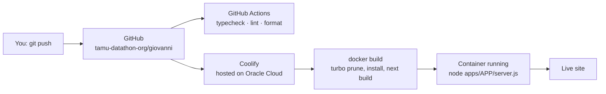

# TAMU Datathon — Engineering Onboarding

Welcome. This repo (`giovanni`) holds **every website TAMU Datathon runs**, plus the shared backend behind them.

No prior web-development experience assumed. Each technology is explained in one sentence the first time it appears.

> **Important layout quirk:** the Git repository root is `giovanni/`, but **all the code lives one level down in `my-turborepo/`**. Nearly every command in this guide is run from inside `my-turborepo/`. This is also why our deploy tool's "Base Directory" is set to `/my-turborepo` and not `/`.

---

## 1. What we build

We have three separate websites, each for a different purposes:

| App                      | Dev port | What it's for                                                                                                                                                      |
| ------------------------ | -------- | ------------------------------------------------------------------------------------------------------------------------------------------------------------------ |
| `apps/event-website`     | **3004** | The `tamudatathon.com` event site — holds: hero, schedule, prizes, FAQ. We change it for every event                                                               |
| `apps/team-website`      | **3000** | `tamudatathon.org` — the org homepage, plus application portal on `/apply`: application form, decision status, accept/decline an offer, and your check-in QR code. |
| `apps/organizer-website` | **3001** | `organizer.tamudatathon.org` — review and accept applications, manage organizer accounts, scan attendees in at the event, and send bulk email.                     |

---

## 2. Repo layout

A **monorepo** means many projects share one Git repository and one dependency install, so shared code doesn't have to be published as a separate library.

```
giovanni/
└── my-turborepo/              ← everything lives here
    ├── apps/                  ← the three websites
    │   ├── event-website/
    │   ├── team-website/
    │   └── organizer-website/
    ├── packages/              ← shared code the apps import
    │   ├── api/               ← @vanni/api   — the backend API
    │   ├── auth/              ← @vanni/auth  — login
    │   ├── db/                ← @vanni/db    — database + schema
    │   └── ui/                ← @vanni/ui    — shared React components
    ├── tooling/               ← shared ESLint / Prettier / Tailwind / TypeScript settings
    ├── .env                   ← our secrets (ssshhhuuushh...)
    └── turbo.json
```

Shared packages are imported by the name `@vanni/...`, e.g. `import { db } from "@vanni/db/client"`.

**Turborepo** is the tool that runs a command (build, lint, dev) across all of these at once, in the right order, and caches the results so repeat runs are fast.

---

## 3. Getting started

### 3.1 Install four tools

| Tool              | What it is                                                                                      | Install                                                            |
| ----------------- | ----------------------------------------------------------------------------------------------- | ------------------------------------------------------------------ |
| **Git**           | Tracks every change to the code and lets the team work in parallel.                             | <https://git-scm.com/downloads>                                    |
| **VS Code**       | The code editor we use. Install the ESLint, Prettier, and Tailwind CSS IntelliSense extensions. | <https://code.visualstudio.com/>                                   |
| **Node.js 20.12** | Runs JavaScript outside a browser.                                                              | <https://nodejs.org/> — pick version **20.x** (pinned in `.nvmrc`) |
| **pnpm 11.1.1**   | Installs and manages our dependencies. Faster and far more disk-efficient than npm.             | Run `corepack enable` and then `pnpm i`                            |

> If you see a tutorial online that says `npm install` or `npx`, use `pnpm install` and `pnpm dlx` instead. Don't use npm

### 3.2 Get it running

```bash
git clone git@github.com:tamu-datathon-org/giovanni.git
cd giovanni/my-turborepo

pnpm install          # install everything for every app at once

cp env.example .env
pnpm dev              # runs the sites
```

To run just one site instead of all three:

```bash
cd apps/team-website # team-website example
pnpm dev
```

### 3.3 About `.env`

Please don't commit it. No more needs to be said.

### 3.4 Everyday commands

Run these from `my-turborepo/`:

| Command           | What it does                                    |
| ----------------- | ----------------------------------------------- |
| `pnpm dev`        | Run all three sites in watch mode               |
| `pnpm build`      | Production build of everything                  |
| `pnpm lint:fix`   | Find and auto-fix code problems                 |
| `pnpm format:fix` | Auto-format all code                            |
| `pnpm db:push`    | Apply your local schema changes to the database |
| `pnpm db:studio`  | Open a browser UI to view/edit database rows    |
| `pnpm ui-add`     | Add a new shadcn/ui component to `@vanni/ui`    |

---

## 4. The shared packages

| Package       | What it is                                                                                                  |
| ------------- | ----------------------------------------------------------------------------------------------------------- |
| `@vanni/db`   | Our **database layer**. Defines every table and gives the rest of the code a typed way to query it.         |
| `@vanni/auth` | Our **login system**. Wraps better-auth and Auth0, and provides the middleware that guards protected pages. |
| `@vanni/api`  | Our **backend API**. All server logic lives here as tRPC "routers."                                         |
| `@vanni/ui`   | Shared **React components** (buttons, forms, inputs) built with shadcn/ui and Radix.                        |
| `tooling/*`   | Shared ESLint, Prettier, Tailwind, and TypeScript settings so every app follows the same rules.             |

---

## 5. How a request works (tRPC)

**tRPC** lets the website call a function on the server as if it were a normal function in the same file — and TypeScript checks the arguments and return type for you. No manually written REST endpoints, no guessing at JSON shapes.

A call travels like this:

```
React component
  → api.application.getApplicationStatus.useQuery()      (src/trpc/react.tsx)
  → POST /api/trpc/...                                   (the route handler)
  → the procedure in packages/api/src/router/application.ts
  → a Drizzle query
  → Postgres
```

In a React Server Component you use `~/trpc/server.ts` instead, which calls the same procedure directly with no network hop.

### Picking the right procedure type

Every endpoint is built from one of four bases, defined in `packages/api/src/trpc.ts`. **Choosing the wrong one is the most common mistake on this codebase** — it either breaks the page or leaks data.

| Base                 | Who can call it                                   |
| -------------------- | ------------------------------------------------- |
| `publicProcedure`    | Anyone, signed in or not                          |
| `protectedProcedure` | Signed in **and** has an `@tamu.edu` email        |
| `organizerProcedure` | Holds the `Organizer` role for the current event  |
| `adminProcedure`     | Email is on the hardcoded allow-list in `trpc.ts` |

### The routers

Defined in `packages/api/src/router/`, combined in `root.ts`:

| Router                   | Handles                                                                          |
| ------------------------ | -------------------------------------------------------------------------------- |
| `auth`                   | Reading the current session                                                      |
| `event`                  | Event details and deadlines                                                      |
| `application`            | The big one — create/update an application, decisions, walk-ins, check-in status |
| `preregistration`        | Email pre-registration before applications open                                  |
| `account`                | Which login provider a user is linked to                                         |
| `email` / `emailSending` | Mailing lists, confirmation emails, bulk sends                                   |
| `organizer`              | Listing, adding, and removing organizers                                         |

---

## 6. The database (Drizzle + Postgres)

Our data lives in a **PostgreSQL** database hosted by **Supabase**.

We talk to it with **Drizzle**, an **ORM** — a tool that lets you write database queries in TypeScript instead of raw SQL, and catches mistakes at compile time:

```ts
const rows = await db
	.select()
	.from(Application)
	.where(eq(Application.userId, userId));
```

### Changing the schema

1. Edit `packages/db/src/schema.ts`.
2. Run `pnpm db:push` to sync your change straight to the database (fast, for local development).
3. For a change that ships to production, generate a tracked migration file instead: `pnpm -F db db:generate`, then `pnpm -F db db:migrate`. Migration SQL is committed in `packages/db/drizzle/`.


### The tables

**Login** (`packages/db/src/auth-schema.ts`, managed by better-auth):

| Table          | Holds                                    |
| -------------- | ---------------------------------------- |
| `User`         | One row per person — name, email, avatar |
| `Account`      | The OAuth provider linked to a user      |
| `Session`      | Active login sessions                    |
| `verification` | Short-lived verification tokens          |

**The event** (`packages/db/src/schema.ts`):

| Table                      | Holds                                                                            |
| -------------------------- | -------------------------------------------------------------------------------- |
| `Event`                    | One hackathon — dates, deadlines, capacity, food groups                          |
| `Role`                     | A named role for an event, e.g. `Organizer`                                      |
| `UserRole`                 | Which users hold which roles                                                     |
| `EventPhase`               | Check-in phases, e.g. day 1 / day 2 / meals                                      |
| `Application`              | A hacker's application — their answers plus status, decision, and check-in flags |
| `Attendance`               | One check-in record per application per phase                                    |
| `UserResume`               | A link to an uploaded resume                                                     |
| `Preregistration`          | Emails collected before applications open                                        |
| `EmailLabel` / `EmailList` | Mailing lists used by the bulk email tool                                        |

---

## 7. Login (Auth0 via better-auth)

**better-auth** is the library that manages sessions and cookies. **Auth0** is a hosted service that handles the actual "Sign in with Google" screens for us.

The key thing to understand: **we use Auth0 purely as a login broker, not with its own SDK.** `packages/auth/src/auth.ts` registers Auth0 as three generic OAuth providers — `auth0-google-oauth2`, `auth0-windowslive` (Microsoft), and `auth0-github` — all pointed at `${AUTH_AUTH0_DOMAIN}/authorize`, `/oauth/token`, and `/userinfo`. So searching the Auth0 SDK docs won't help you here; read `auth.ts` instead.



### Two separate gates

These are easy to confuse, and they do different jobs:

1. **Route gate** — `packages/auth/src/middleware.ts`. Checks for a `better-auth.session_token` cookie on any `/admin`, `/apply`, or `/organizer` route, and redirects to `/login?callbackUrl=…` if it's missing.

> **Gotcha:** `BETTER_AUTH_URL` must exactly match the origin you're browsing. Locally that's `http://localhost:3001` for organizer-website and `http://localhost:3000` for team-website. A wrong value here is the usual cause of a `state_mismatch` error on login.

---

## 8. Hosting and deploys (Oracle Cloud + Coolify)

- **Oracle Cloud** provides the raw computing resources — the virtual machines and CPU our sites run on.
- **Coolify** is a self-hosted deployment platform that runs _on_ that Oracle infrastructure. It's what we actually interact with: it watches GitHub, builds each site, holds the environment variables, manages domains and HTTPS, and divides the Oracle CPU resources among the sites.

Each app has its own `Dockerfile`. A **Docker container** is a self-contained box holding the app and everything it needs to run, so it behaves identically on your laptop and on the server. Ours all follow the same shape:

`turbo prune` (strip the monorepo down to just this app) → `pnpm install` → `next build` → copy the small standalone output into a clean `node:22-alpine` image → run as a non-root user with `node apps/APP_NAME/server.js`.



### Two Coolify settings people get wrong

1. **Base Directory must be `/my-turborepo`**, not `/`. The monorepo is nested one level inside the repo root, and the Dockerfile location is resolved relative to it.
2. **`NEXT_PUBLIC_*` variables must be marked "Available during build"** (Coolify's default — leave it checked). Next.js bakes these into the browser bundle at build time, so setting them only at runtime does nothing at all, silently.

Also note: the Docker build context is the monorepo root, so the root `.dockerignore` is the one that applies.

### CI does not deploy

`.github/workflows/main.yml` runs on every pull request: it typechecks, lints, formats, and auto-commits any fixes back to your branch. It does **not** build images or deploy. Coolify handles deploys itself, straight from Git.

---

## 9. Environment variables


| Group        | Variables                                                                                                                          | Purpose                                                                                        |
| ------------ | ---------------------------------------------------------------------------------------------------------------------------------- | ---------------------------------------------------------------------------------------------- |
| Database     | `POSTGRES_URL`                                                                                                                     | Supabase Postgres connection string                                                            |
| Auth         | `AUTH_SECRET`, `BETTER_AUTH_URL`, `AUTH_AUTH0_ID`, `AUTH_AUTH0_SECRET`, `AUTH_AUTH0_DOMAIN`                                        | Signing sessions, and the Auth0 application credentials                                        |
| Email        | `AWS_ACCESS_KEY_ID`, `AWS_SECRET_ACCESS_KEY`, `AWS_REGION`, `AWS_EMAIL_USER`, `AWS_SQS_MAIL_URL`                                   | Queueing and sending transactional mail                                                        |
| File storage | `BLOB_READ_WRITE_TOKEN`                                                                                                            | Uploading resumes to Vercel Blob                                                               |
| App config   | `NEXT_PUBLIC_EVENT_NAME`, `NEXT_PUBLIC_ENV`                                                                                        | Which event row to use; dev vs production behavior                                             |
| Google tools | `NEXT_PUBLIC_GOOGLE_CLIENT_ID`, `NEXT_PUBLIC_DRIVE_FOLDER_ID`, `NEXT_PUBLIC_DRIVE_FOLDER_NAME`, `NEXT_PUBLIC_GOOGLE_SHEET_API_URL` | The organizer email generator and schedule manager                                             |
| Build only   | `SKIP_ENV_VALIDATION`                                                                                                              | Set by the Dockerfile so server secrets aren't needed to build an image. Never set at runtime. |

Remember: anything starting with `NEXT_PUBLIC_` is **visible to anyone using the site.** Never put a secret in one.

---

## 10. Outside services we depend on

| Service                    | What we use it for                                                                                                  | Where in the code                                           |
| -------------------------- | ------------------------------------------------------------------------------------------------------------------- | ----------------------------------------------------------- |
| **Auth0**                  | Brokers Google / Microsoft / GitHub logins                                                                          | `packages/auth/src/auth.ts`                                 |
| **Supabase**               | Hosts our Postgres database (we use it as a database only)                                                          | `packages/db/src/client.ts`                                 |
| **Vercel Blob**            | Stores uploaded resume files                                                                                        | `apps/team-website/src/app/api/resume/route.ts`             |
| **AWS SQS → Lambda → SES** | Bulk and transactional email. This repo only puts messages on the queue; the Lambda that sends them lives elsewhere | `packages/api/src/router/emailHelpers/queue_bulk.ts`        |
| **Google Drive & Sheets**  | Stores email templates; a Sheet backs the public schedule                                                           | `apps/organizer-website/src/app/organizer/email-generator/` |
| **QR codes**               | Generated for each attendee, scanned by organizers to check people in                                               | `apps/organizer-website/src/app/organizer/passport/`        |

---

## 11. Contributing

1. Branch off the current working branch (`main-teamv3` today) — never commit directly to it.
2. Make your change, then run and `pnpm lint:fix` before pushing.
3. Open a pull request. CI will typecheck it and auto-commit any lint/format fixes.
4. Get a review, then merge.

> You'll see branches named `main`, `main-fall-2025`, `main-teamv3`, and so on. We branch per semester, so ask which one is current before you start — the newest is not always the right one.

---